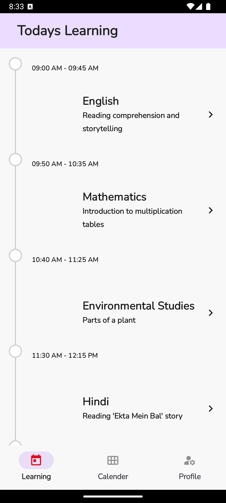
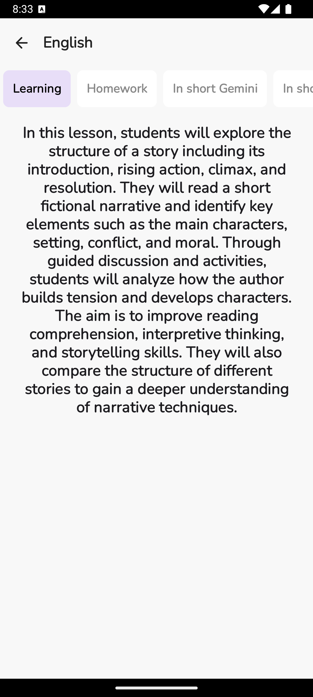
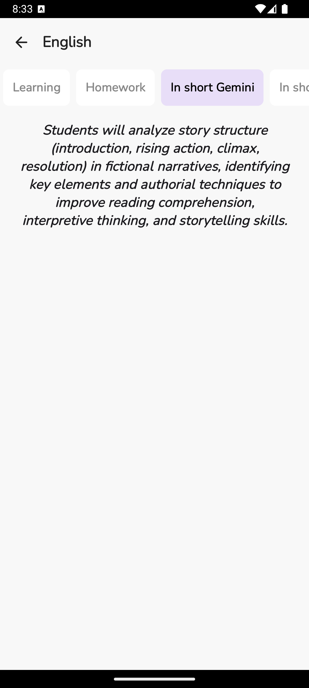
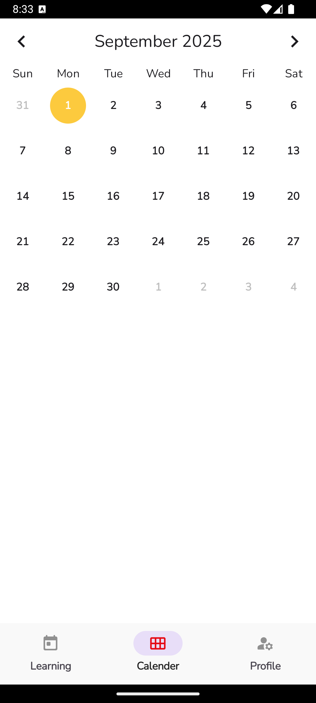
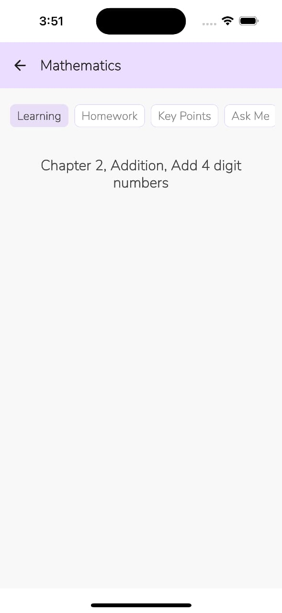
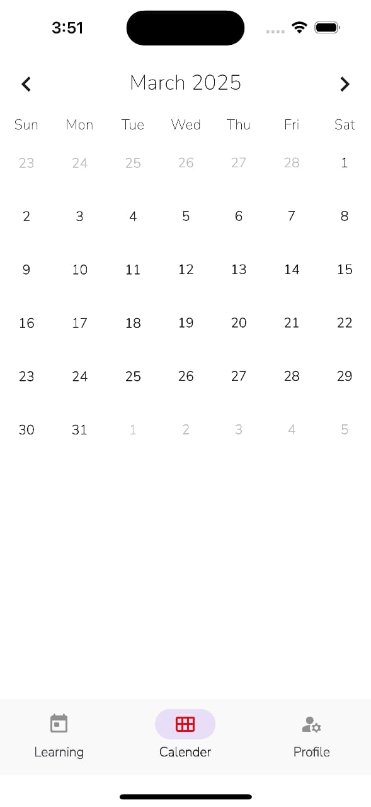
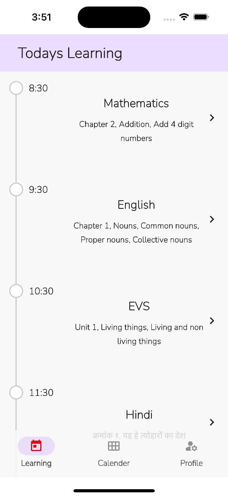
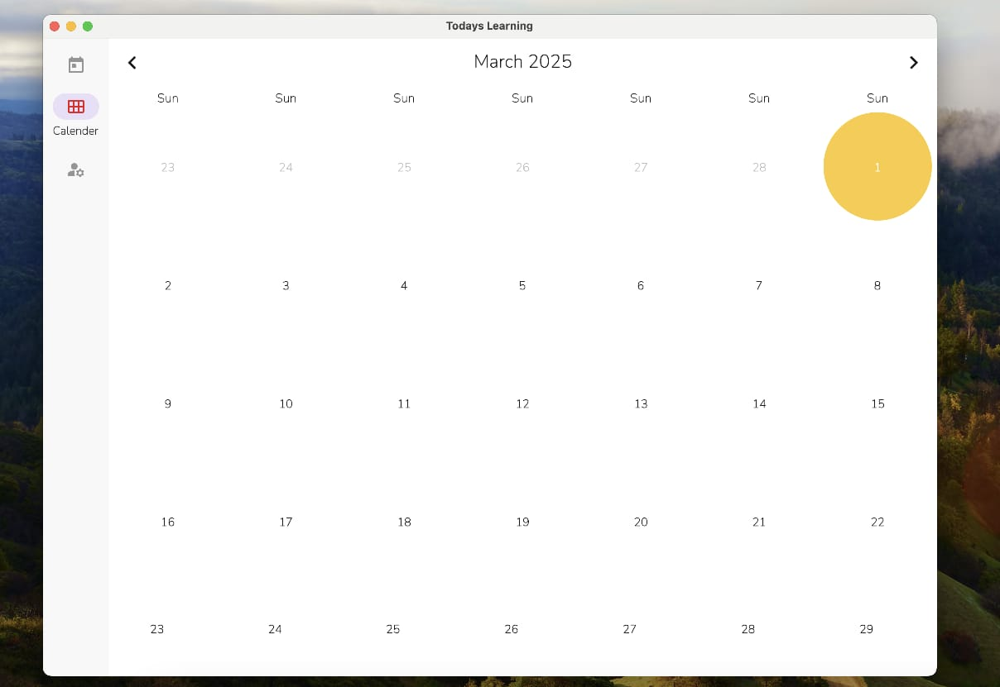
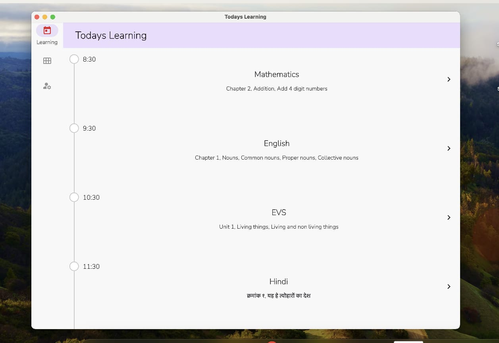

# Today's Learning - Sample kmp app  

Today's Learning is a multiplatform app built using Kotlin and Compose Multiplatform. 

## Screenshots

#### Mobile App (Android)

        

#### Mobile App (iOS)

        

#### Desktop App

    

## Built with 🛠️

- [Kotlin Multiplatform](https://kotlinlang.org/lp/multiplatform/)
- [Kotlin Coroutines](https://github.com/Kotlin/kotlinx.coroutines)
- [Compose Multiplatform](https://www.jetbrains.com/lp/compose-multiplatform/)
- [BuildKonfig](https://github.com/yshrsmz/BuildKonfig)

## Development 🛠️

### Pre-requisites

- Java JDK 17+
- Latest stable version of Android Studio IDE
- Latest XCode (_for iOS_)

### Setup

- Clone this repository.
- Open in the _latest version_ of Android Studio.

- Run the app on your device or emulator:
    - For Android, run `androidApp` module by selecting `app` configuration.
    - For iOS, run `iosApp` module by selecting `iosApp` configuration.
    - For Desktop, run `./gradlew run`
